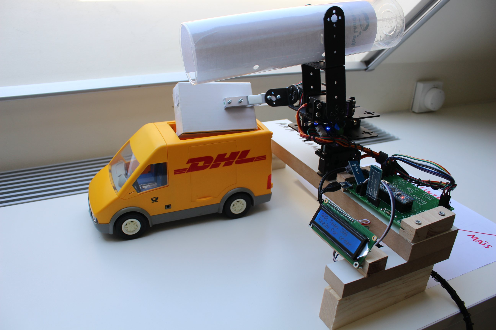
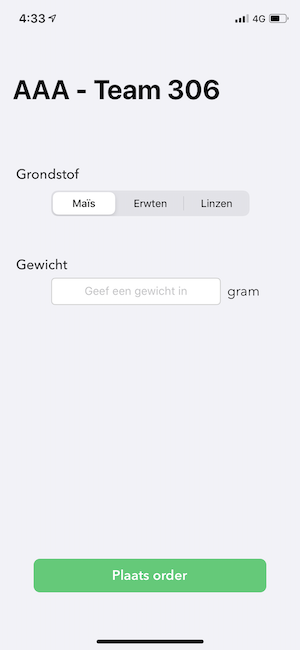

# AAA of Team 306

`AAA` is a Dutch abbreviation and translates to an **automatic weighing device**. The goal of this project was to select one out of three resources (peas, lentils and corn) from a mobile app. The app connects to the device, which then loads up the correct weight of the resource and drops it into a container.

Originally intended as an **eight man job**, the final result found below is a **best-effort** device. Due to `COVID-19`, much of the project had to be done remotely. Instead of dedicated teams for the structure, the electronics and the mobile app, much of the actual building came down to the one in possession of the parts.

We decided to play the cards we were dealt and undertook action. We had the `printed circuit boards` manufactured in China, because the PCB milling at the university was cancelled. The `3D printers` were also unaccessible, so we bolted some pieces of aluminum, wood and cardboard together.

⚠️ **Fair word of warning**: Shortcuts were taken. Code was written in a dirty way. Keep in mind this is a best-effort implementation solely built with hardware lying around. In normal times, this would've been an awesome project.

## Project in action

See the project in action [on YouTube](https://youtu.be/yPYPrarYF-o).

### The device

### The iPhone app

  

